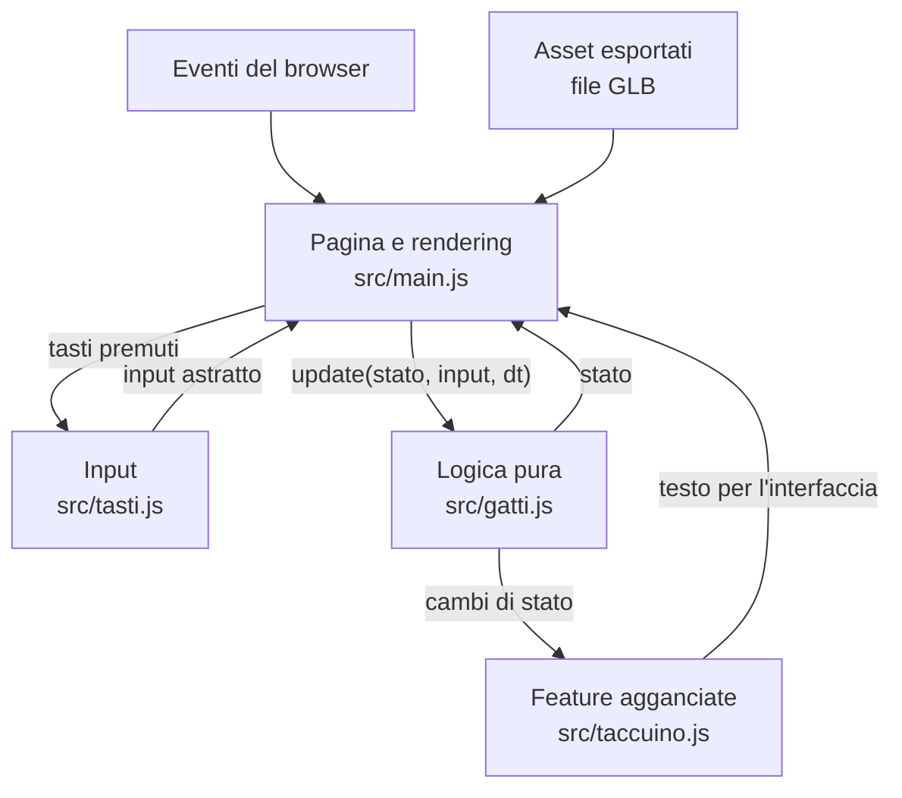
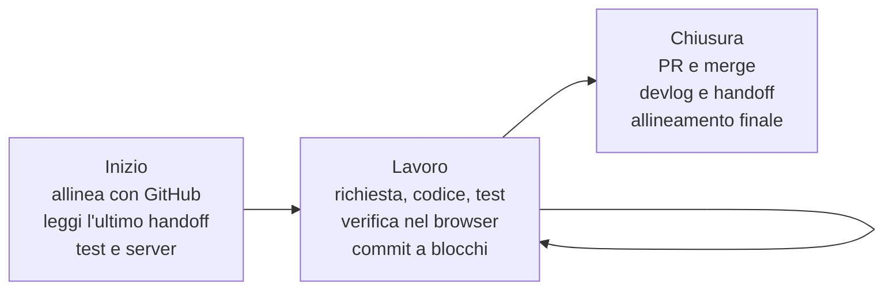

# Blueprint: sviluppare app e giochi con Claude Code

> **Documento vivo.** Nasce dal lavoro su Pet Them All (13-15 settembre 2026) e si aggiorna ogni volta che il modo di lavorare cambia. Le modifiche sono elencate nel [registro](#registro-delle-modifiche) in fondo.

Questo documento descrive come impostare, sviluppare e documentare un progetto, che sia un'app o un gioco, lavorando con Claude Code. Non è un regolamento: è il punto di partenza da adattare e migliorare. Dove il processo seguito in Pet Them All aveva dei limiti, qui è già corretto, e la sezione [Miglioramenti rispetto a Pet Them All](#7-miglioramenti-rispetto-a-pet-them-all) elenca cosa cambia.

## Come usarlo

- **Nuovo progetto:** copia questo file nella nuova repo e segui la [checklist di avvio](#1-avvio-di-un-progetto). I file modello citati sono in [MarcoLP1822/pet_them_all](https://github.com/MarcoLP1822/pet_them_all).
- **Durante il lavoro:** le sezioni su architettura, flusso di lavoro e qualità sono il riferimento.
- **Per migliorarlo:** quando una sessione cambia il processo o insegna qualcosa che vale anche per altri progetti, aggiorna la sezione giusta e aggiungi una riga al registro. I dettagli del singolo progetto restano nel suo handoff.
- **Copia di riferimento:** per ora è questa, in Pet Them All. I miglioramenti nati in altri progetti vanno riportati qui. Quando i progetti che lo usano saranno almeno due, conviene spostare il blueprint in una repo a sé, anche come template di GitHub.

## Principi

1. **Prima la meccanica, poi lo stile.** Il cuore del gioco o dell'app si prova con forme e interfacce segnaposto. Grafica e asset definitivi arrivano in una fase separata.
2. **Il minimo che funziona.** Niente astrazioni, dipendenze o configurazioni "per dopo": prima la libreria standard e le funzioni native della piattaforma.
3. **Ogni feature ha il suo test**, scritto e fatto girare prima di passare alla successiva.
4. **La logica non sa niente dello schermo.** Regole e stato stanno in moduli puri, testabili senza browser.
5. **Prima le prove, poi la correzione.** Un bug si riproduce e si misura prima di toccare il codice.
6. **Tutto lascia traccia:** commit e PR per il codice, devlog per il pubblico, handoff per chi riprende il lavoro.
7. **I documenti sono vivi:** si aggiornano quando cambia la realtà che descrivono.

## 1. Avvio di un progetto

Checklist del primo giorno, in quest'ordine:

1. **Repo locale.** `git init` con branch principale `main`: decidilo subito, perché cambiarlo dopo costa. `.gitignore` con almeno `.DS_Store`, `node_modules/` e `*.blend1`.
2. **Repo su GitHub.** Creala con `gh repo create --description "..." --homepage "..."`, così descrizione e sito ci sono da subito. Se il devlog andrà su GitHub Pages e il piano è gratuito, la repo deve essere pubblica: decidilo prima di metterci dentro qualcosa.
3. **Impostazioni del repo.** `gh repo edit --delete-branch-on-merge`, così i branch delle PR unite si cancellano da soli.
4. **Struttura delle cartelle:**
   ```
   README.md           panoramica: cos'è, come si avvia, struttura
   BLUEPRINT.md        questo documento
   CREDITS.md          fonte e licenza degli asset
   index.html          pagina dell'app (progetti web)
   src/                moduli puri + un solo modulo che parla con DOM e rendering
   test/               test con il runner nativo
   tools/              script di sviluppo: server locale, fuzz, screenshot, generazione degli asset
   assets/             sorgenti (.blend) ed export (.glb)
   docs/               devlog pubblicato con GitHub Pages
   .github/workflows/  CI: i test girano su ogni PR
   .claude/
     rules/            convenzioni per Claude
     hooks/            controlli automatici (devlog)
     settings.json     registra gli hook
     launch.json       server di anteprima
     handoff/          un documento per sessione
   ```
5. **Regole per Claude** in `.claude/rules/`, una per argomento: convenzioni di sviluppo e fase attuale, asset, handoff, blueprint. Modelli: `gameplay.md`, `blender-mcp.md`, `handoff.md` e `blueprint.md` di Pet Them All.
6. **Server locale senza cache** in `tools/serve.py` (modello: `serve.py` di Pet Them All), avviato da `npm start` e da `.claude/launch.json`.
7. **Test e CI.** `npm test` esegue `node --test`, e un workflow lo ripete su ogni push al branch principale e su ogni PR, insieme al fuzz quando c'è (modello: `.github/workflows/test.yml` di Pet Them All):
   ```yaml
   # .github/workflows/test.yml
   name: test
   on:
     push:
       branches: [main]
     pull_request:
   jobs:
     test:
       runs-on: ubuntu-latest
       steps:
         - uses: actions/checkout@v4
         - uses: actions/setup-node@v4
           with:
             node-version: 22
         - run: npm ci
         - run: npm test
         - run: npm run fuzz --if-present
   ```
   Limitare `push` al branch principale evita che ogni push su un branch con una PR aperta faccia partire la CI due volte. Lo script di fuzz va fuori da `test/`, per esempio in `tools/`: `node --test` esegue qualsiasi file dentro `test/`.
8. **Devlog.** Jekyll in `docs/`, GitHub Pages da `main` `/docs`, con il primo post il giorno stesso (vedi [Devlog](#devlog)). Hook del devlog in `.claude/hooks/`, registrato come Stop hook in `.claude/settings.json`.
9. **README** con cos'è il progetto, come si avvia, come si lanciano i test e com'è organizzata la repo.

## 2. Architettura di base

### Stack di riferimento per il web

| Esigenza | Scelta | Perché |
|---|---|---|
| Codice | JavaScript con ES modules e `importmap` | Nessun bundler finché non serve davvero |
| 3D | three.js da `node_modules` | Stabile, carica i GLB |
| Test | `node --test` con `node:assert` | Nessuna dipendenza in più |
| Server locale | Python, libreria standard, `Cache-Control: no-store` | Evita di provare codice vecchio preso dalla cache |
| Devlog | Jekyll con la build classica di GitHub Pages | Gratuito, nessun workflow da mantenere |
| Asset 3D | Blender, export GLB | Formato standard per il web |

Per progetti non web, come un'app nativa o un backend, valgono gli stessi strati: cambiano solo gli strumenti.

### Strati



| Strato | Responsabilità | Regole | Esempio in Pet Them All |
|---|---|---|---|
| Logica pura | Stato, regole, macchina a stati, `update(stato, input, dt)` | Niente DOM né renderer; parametri in un unico oggetto; caso iniettabile | `src/gatti.js` |
| Feature | Comportamenti che reagiscono ai cambi di stato | Si agganciano a un unico punto di passaggio, senza duplicare la macchina a stati | `src/taccuino.js` |
| Input | Da eventi grezzi a un input astratto | `event.code`; gestione di focus e tasti di sistema | `src/tasti.js` |
| Pagina | Carica gli asset, collega input e logica, disegna, aggiorna l'interfaccia | È l'unico modulo che tocca DOM e renderer, e non contiene regole | `src/main.js` |
| Asset | Geometria, nomi, posizioni iniziali | Il file esportato è un contratto con il codice | `assets/livello-test.glb` |

### Contratti

- **Macchina a stati esplicita.** Gli stati sono costanti e ogni transizione passa da una sola funzione (in Pet Them All `entra()`), che è anche il punto dove si agganciano le feature.
- **Parametri centralizzati** in un oggetto (`PARAMS`), con un commento sul perché di ogni valore. I valori legati tra loro si derivano: per esempio la velocità di fuga è un multiplo di quella del personaggio.
- **Tempo e caso sotto controllo.** `update` riceve `dt`, e il caso arriva da una funzione `random` iniettabile: così i test sono ripetibili e il fuzz può usare semi.
- **Ordine di aggiornamento documentato**, quando conta. In Pet Them All: fuga, spavento, arrivo, carezza.
- **Asset collegati per nome, non per ordine.** Il codice cerca i nodi per nome e da lì ricava identità e posizioni.
- **Dati dal livello, non dal codice.** Dimensioni dell'area e posizioni iniziali si leggono dal file esportato.

### Input nei giochi per browser

- Leggi `event.code`, non `event.key`.
- Non usare Ctrl né Cmd nei comandi di gioco. Su macOS Ctrl+frecce cambiano scrivania o aprono Mission Control e non arrivano alla pagina; su Windows Ctrl+W chiude la scheda e la pagina non può impedirlo.
- Svuota i tasti premuti su `blur` e al rilascio di Cmd: mentre Cmd è premuto, su macOS non arrivano i keyup degli altri tasti.
- Chiama `preventDefault` solo sui tasti di gioco.
- I problemi di sistema operativo non si riproducono con eventi simulati: vanno provati con la tastiera vera.

## 3. Asset e Blender

- **Fase segnaposto.** La geometria si genera con script bpy tramite Blender MCP, in una collezione dedicata.
- **Script nella repo.** Lo script che genera il livello va in `tools/blender/`, così il livello si può rigenerare.
- **`.blend` salvato subito** nella repo, appena creato, non a fine giornata.
- **Export.** GLB della sola collezione, con Y in alto: un punto (x, y) sul piano di Blender diventa (x, z = −y) in three.js. Origine degli oggetti alla base, nomi dei nodi senza punti.
- **Regole in `.claude/rules/`.** Budget di poligoni, motore di render per le anteprime, ordine di preferenza tra download e generazione (modello: `blender-mcp.md`).
- **Crediti.** Ogni asset scaricato o generato va in `CREDITS.md`, con fonte e licenza.
- **Prova dopo ogni export.** Il file esportato è un contratto con il codice: dopo ogni export si avvia il gioco e si controlla.

## 4. Flusso di lavoro con Claude Code

### Ciclo di una sessione



**Inizio**

1. `git fetch` e confronto con GitHub. Se ci sono branch `claude/...` delle sessioni in cloud, si provano i test e si uniscono con una PR.
2. Si legge l'handoff più recente in `.claude/handoff/`.
3. `npm test`, poi `npm start`.

**Durante**

- Una richiesta alla volta: si implementa, si scrive o si aggiorna il test, e se il cambiamento si vede si verifica nel browser.
- Le scelte ambigue si chiedono subito, con un'opzione consigliata.
- Si fa commit a blocchi logici appena i test sono verdi, su un branch di sessione. Il merge si fa in chiusura.

**Chiusura**

1. Test verdi.
2. PR con Cosa, Perché, Note e Test; merge sul branch principale dopo la conferma esplicita.
3. Post del devlog, se c'è un checkpoint reale.
4. Handoff della sessione, committato. In cima al precedente si aggiunge una riga che rimanda al nuovo.
5. README e blueprint aggiornati, se sono cambiati uso o processo.
6. Controllo finale: copia locale uguale a GitHub, nessun branch in sospeso, server fermo, scene Blender salvate.

### Git e pull request

- Un branch per blocco di lavoro, con un nome descrittivo.
- Commit in inglese: titolo breve e corpo che spiega il perché.
- Descrizione della PR in quattro parti: Cosa, Perché, Note per chi revisiona, Test.
- La CI deve essere verde prima del merge.
- Merge con merge commit; i branch uniti si cancellano da soli.
- Il merge sul branch principale va confermato esplicitamente dall'utente: in modalità automatica il controllo dei permessi può bloccarlo.

### Sessioni locali e in cloud

- Le sessioni in cloud leggono solo ciò che è nella repo: regole, handoff e blueprint vanno committati.
- Lavorano su branch `claude/...` senza aprire PR: alla ripresa in locale vanno allineati (vedi Inizio). Se possibile, chiedi alla sessione in cloud di aprire una PR a fine lavoro, così il lavoro è visibile subito.

### Lingue

- Conversazione, regole, handoff, README e blueprint in italiano.
- Commit e PR in inglese.
- Devlog in italiano e inglese.

## 5. Qualità: test, verifica, debug

### Test

- Almeno un test per feature, che fallisca se la logica si rompe.
- Test deterministici: `dt` fisso, caso iniettato o generatore con seme.
- Per le regole con molti casi, come angoli e bordi, si prova un intervallo di valori, non un solo esempio.
- Quando c'è del caso, si esegue la suite più volte di fila per scoprire i test instabili.

### Verifica nel browser

- Dopo ogni cambiamento visibile: si carica la pagina, si controllano console e rete, si prova l'interazione.
- Nel browser integrato i tasti si simulano con `KeyboardEvent` impostando `code`, e si fanno screenshot prima e dopo.
- Se dopo una modifica non cambia niente, si controlla che il browser non stia usando file in cache: `transferSize` 0 in `performance.getEntriesByType('resource')`.

### Debug

1. **Riprodurre con le prove.** Si registrano gli eventi reali nella pagina, si leggono in sola lettura le impostazioni di sistema coinvolte, si confrontano i casi che funzionano con quelli che no.
2. **Fuzz della logica.** Si simulano centinaia di partite con input casuali e strategie mirate, controllando a ogni frame le regole: transizioni, raggi, bordi, durate. Lo script sta in `tools/fuzz.mjs` e si lancia con `npm run fuzz`; per ogni nuova meccanica si aggiunge la sua regola.
3. **Correggere alla radice.** Una guardia nel punto da cui passano tutti i chiamanti, non in ogni chiamante.
4. **Lasciare il test** che avrebbe preso il bug.

### Trappole note

| Trappola | Sintomo | Rimedio |
|---|---|---|
| Ctrl+frecce su macOS | Alcune direzioni non rispondono | Niente Ctrl nei comandi |
| Keyup persi con Cmd premuto | Un tasto resta premuto da solo | Liberare i tasti al rilascio di Cmd |
| Cache del browser | Le modifiche non si vedono | Server con `Cache-Control: no-store` |
| Cache di GitHub Pages | Il sito non si aggiorna subito | Aggiungere `?v=...` all'URL per controllare |
| Chrome headless nel sandbox di Bash | Si blocca | Eseguirlo fuori dal sandbox |
| Blender chiuso senza salvare | La scena sparisce | Salvare subito; recupero da `quit.blend` |
| Glob senza risultati in zsh | Il comando si interrompe | Controllare prima che i file esistano |

## 6. Documentazione viva

| Documento | Per chi | Quando si aggiorna | Regole |
|---|---|---|---|
| `README.md` | Chi arriva sulla repo | Quando cambiano uso, avvio o struttura | Breve, rimanda agli altri documenti |
| Handoff in `.claude/handoff/` | Chi riprende il lavoro | A ogni chiusura di sessione | Uno per sessione, completo, committato |
| Devlog in `docs/_posts/` | Il pubblico | A ogni checkpoint reale | Italiano e inglese, data e ora, i post vecchi non si riscrivono |
| `BLUEPRINT.md` | I progetti futuri | Quando cambia il processo o emerge una lezione riusabile | Solo cose riusabili, registro delle modifiche |
| Commenti nel codice | Chi legge il codice | Insieme al codice | Spiegano il perché, non il cosa |
| `CREDITS.md` | Tutti | A ogni asset | Fonte e licenza |

### Handoff

- Sezioni: sommario; checkpoint con commit e PR; architettura; decisioni con il loro perché; gotcha; problemi aperti e prossimi passi.
- Si scrive per chi non ha visto la sessione: percorsi, comandi, parametri.
- Quando se ne scrive uno nuovo, in cima al precedente va una riga che rimanda al nuovo.

### Devlog

- **Struttura del sito.** Jekyll in `docs/` con il tema minima, `timezone` e formato data con l'ora in `_config.yml`, pulsante lingua che ricorda la scelta. Modelli: `docs/` di Pet Them All.
- **Front matter di ogni post:** `title`, `title_en` e `date` con ora e fuso, per esempio `date: 2026-09-14 15:18:16 +0200`.
- **Testo:** in blocchi `<div lang="it" markdown="1">` e `<div lang="en" markdown="1">`.
- **Stop hook.** Se ci sono commit di oggi sul branch principale e manca il post del giorno, chiede di scriverlo oppure di dire che non serve. Modello: `.claude/hooks/devlog-check.sh`, con `git log main --since=...` al posto di `git log --since=...`.
- **Screenshot.** Si fanno con Chrome headless, tramite uno script tenuto in `tools/`.

## 7. Miglioramenti rispetto a Pet Them All

| Miglioramento | Perché | Com'è in Pet Them All |
|---|---|---|
| Branch principale `main` deciso subito | Cambiarlo dopo costa | Si chiama `master` |
| README, descrizione e sito del repo dal primo giorno | La repo si presenta da sola | Aggiunti a progetto avviato |
| Server senza cache dal primo giorno | Evita di provare codice vecchio | Aggiunto dopo un bug |
| CI con test e fuzz su ogni PR | I merge non sono più alla cieca | Adottata il 15 settembre |
| Cancellazione automatica dei branch uniti | Niente branch vecchi da pulire | Branch vecchi ancora su GitHub |
| Script di sviluppo in `tools/` (server, fuzz, screenshot, generazione del livello) | Si possono rilanciare in ogni momento | Fuzz in `tools/fuzz.mjs` dal 15 settembre; server ancora alla radice; screenshot e generazione del livello fuori dalla repo |
| `.blend` salvato subito nella repo | Una scena non salvata si perde | Recuperato da `quit.blend` |
| Asset collegati per nome | L'ordine dei nodi nel file può cambiare | I numeri dei gatti seguono l'ordine nel GLB |
| Comandi senza Ctrl e Cmd, tasti liberati su blur e al rilascio di Cmd | Evita i problemi di macOS e Windows | Corretto dopo due bug |
| Data con l'ora nei post fin dal primo | Ordine giusto tra post dello stesso giorno | Aggiunta dopo |
| Hook del devlog che conta solo i commit sul branch principale | Si può fare commit spesso senza richieste di post a metà lavoro | Conta i commit di qualunque branch |
| Commit a blocchi durante la sessione | Niente commit accumulati fino a fine giornata | Commit fatti in chiusura |
| Handoff precedente con una riga che rimanda al nuovo | Chi apre un handoff vecchio sa dove andare | Avviso scritto a mano sul primo handoff |

## Registro delle modifiche

| Data | Modifica |
|---|---|
| 2026-09-15 | Prima versione, ricavata dalle sessioni del 13-15 settembre su Pet Them All |
| 2026-09-15 | CI e fuzz adottati in Pet Them All. Nel modello di CI il push conta solo per il branch principale, c'è il passo `npm run fuzz --if-present` e il fuzz sta fuori da `test/` |
